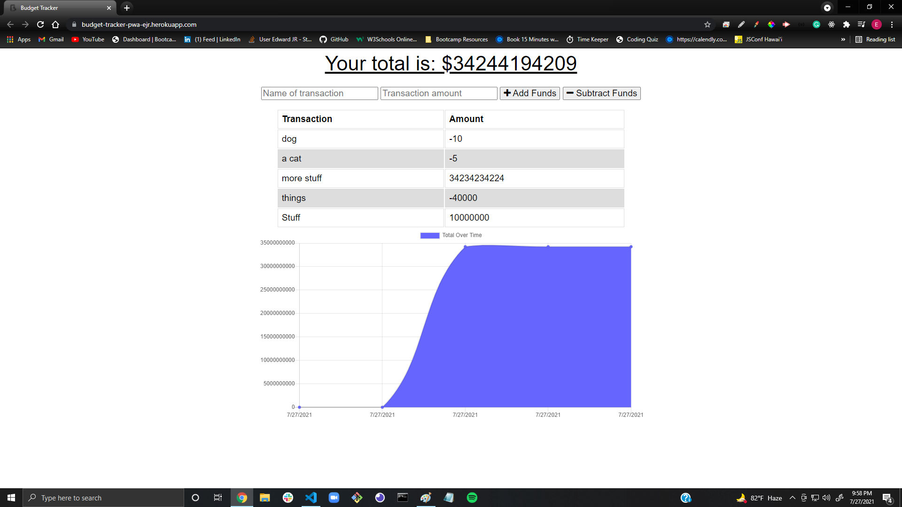

# Budget Tracker (PWA) 

  
[Link to Deployed Application](https://budget-tracker-pwa-ejr.herokuapp.com)

# Description

An online/offline app designed to help you monitor your budget.

# Table Of Contents

- [Installation](#installation)
- [Usage](#usage)
- [License](#license)
- [Contributing](#contributing)
- [Tests](#tests)
- [Questions](#questions)

# Installation

User only needs a working browser to use this application.

# Usage

Navigate in your browser to the deployed application url. You will be presented with an interface containing input fields for "Transaction", "Amount" "Add Funds", "Subtract Funds", a list of previous transactions and their amounts, and a dynamically responsive graph displaying all of the previously input data. This should help you whenever you are unable to use a wifi signal or your data plan. Once you reconnect to the internet after inputting items, the data will be synced and you practically should not even notice the app ever went offline in the first place. That, is the power of PWA's my friend!

# License

This application is protected under conditions of the MIT license.

# Contributing

I am the only contributor to this project.

# Tests

No tests are needed for this app at the moment.

# Questions

My GitHub Profile: http://www.github.com/relentlessreed  
Please feel free to contact me with any inquiries via email at relentlessreed@gmail.com.
